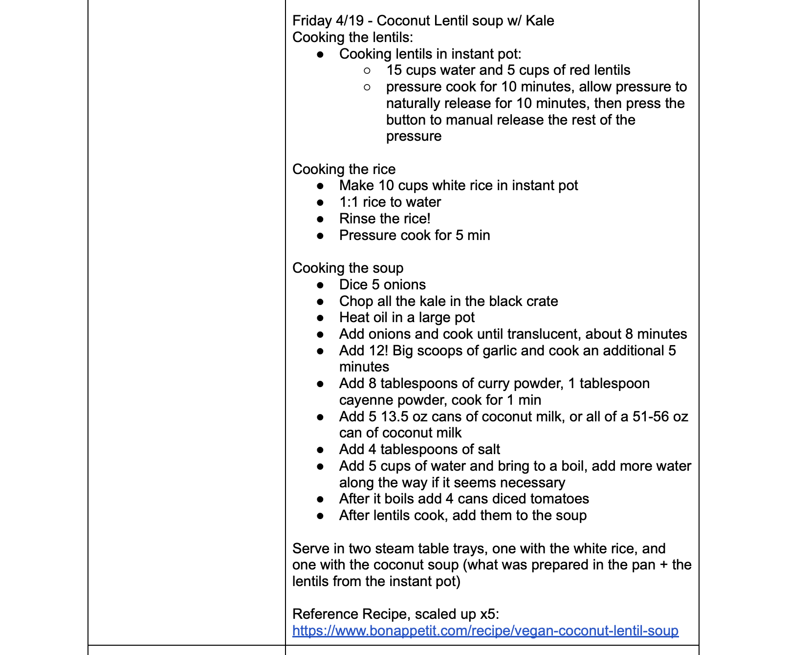

# Analyzing Food Cooperative Sales Data

Author: Marguerite Church

## Overview

This is an independent project done for the UCSD Food Cooperative during the summer of 2024 with
sales data from the 2023-2024 school year. The goal is to explore what recipes sell best and what ingredients they contain.

# Introduction

## What is the UCSD Food Cooperative?

The UCSD Food Cooperative is a non-hierarchical student run organization that serves cheap vegan meals daily to the greater UCSD community. Alongside vegan meals made in the space, we serve food from vendors such as sambusas, drinks such as kombucha and coconut water, and basic needs supplies. All of the work is volunteer based, so any profits we make go right back into the space. We are open on weekdays from 11-3, and serve free food on fridays. If you are interested in learning more, here is our [Instagram](https://www.instagram.com/ucsdfoodcoop/?hl=en).

## Project Introduction

As a member of the food coop, I am interested in the ways we can boost our sales so that we can offer a greater variety of foods and goods. Knowing what items sell best and what days we profit on can help us grow and be able to better serve our community. 

## Data Introduction

I created this dataset myself by going through our archived menu documents and sales data from Square. Here is what the menu for one day looks like:

# Data Cleaning and Exploratory Data Analysis
